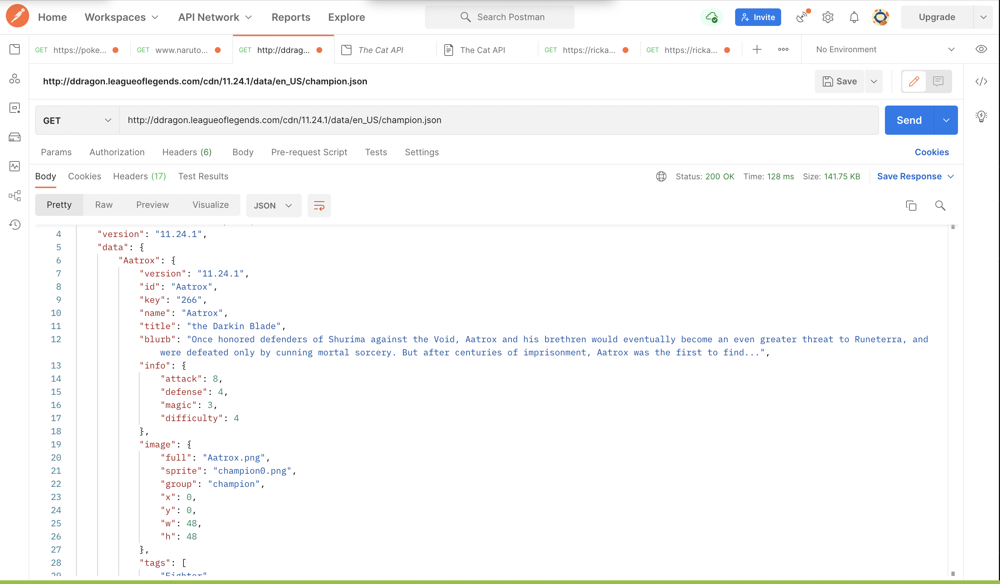
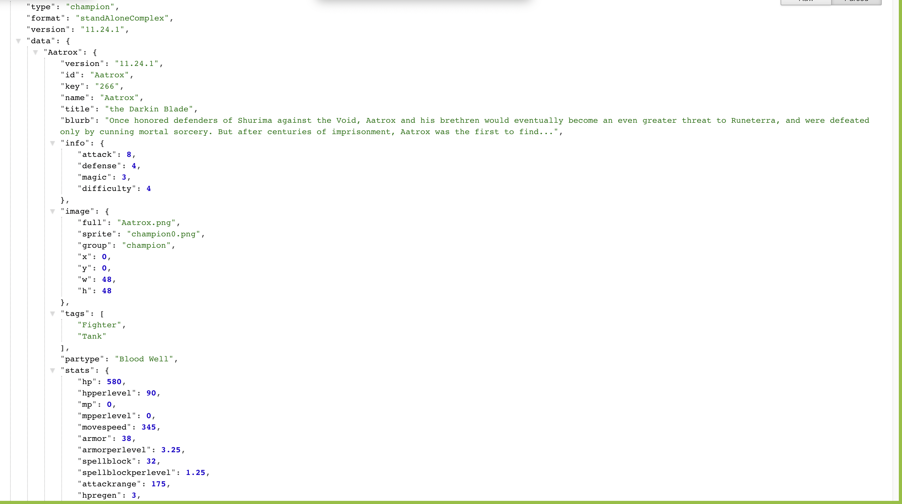
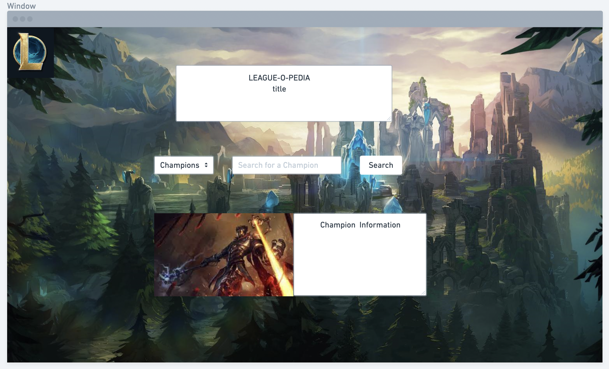

PROJECT OVERVIEW
- **App Title**:
LEAGUE-O-PEDIA
- **App Description**: 
- **API**: 

- **API Snippet**: 

- **Wireframes**:  
[wireframelink](https://whimsical.com/EiR7gX8hZgw1B2xqJAsCnS)

# **MVP**: 
  - Take user input from a search bar to find League Champions
  - Call and use data from League of legends API
  - Render Champion name, title, image, and lore data from API
  - Use a dropdown menu to select Champions for new users
  - Create stylish responsive css design via flexbox to manipulate Champion data appearance
- **Post-MVP**: 
- **Goals**: 
- **Priority Matrix**: 
- **Timeframes**:
