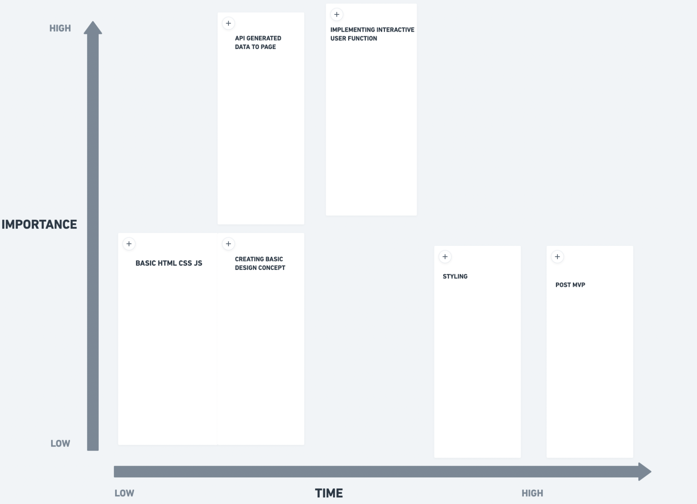

PROJECT OVERVIEW
# **App Title**:
## LEAGUE-O-PEDIA
# **App Description**: 
This LEAGUE-O-PEDIA application allows both new and veteran league of legends enthusiasts to browse through a collection of league of legends champions! This database allows users to find information on their potential favorite Champion! This data includes the name of the champion, title and basic lore to further engage the users interests!
# **API**: 

# **API Snippet**: 
```
json
{
"type": "champion",
"format": "standAloneComplex",
"version": "11.24.1",
"data": {
"Aatrox": {
"version": "11.24.1",
"id": "Aatrox",
"key": "266",
"name": "Aatrox",
"title": "the Darkin Blade",
"blurb": "Once honored defenders of Shurima against the Void, Aatrox and his brethren would eventually become an even greater threat to Runeterra, and were defeated only by cunning mortal sorcery. But after centuries of imprisonment, Aatrox was the first to find...",
"info": {
"attack": 8,
"defense": 4,
"magic": 3,
"difficulty": 4
},
"image": {
"full": "Aatrox.png",
"sprite": "champion0.png",
"group": "champion",
"x": 0,
"y": 0,
"w": 48,
"h": 48
},
"tags": [
"Fighter",
"Tank"
```
# **Wireframes**:  
[wireframelink](https://whimsical.com/EiR7gX8hZgw1B2xqJAsCnS)

# **MVP**: 
  - Take user input from a dropdown to find League Champions
  - Call and use data from League of legends API
  - Render Champion name, title, image, and lore data from API
  - Create stylish responsive css design via flexbox to manipulate Champion data appearance
# **Post-MVP**: 
  - create a section that replaces current info and includes the following data below
  - implement a search bar with a dropdown to filter options for new and experienced players alike.
  - Show data of Champion abilities from the api
  - Show Champion ability effects
  - Show ability sprites from the api
  
# **Priority Matrix**: 
[Priority matrix link](https://whimsical.com/EiR7gX8hZgw1B2xqJAsCnS)


# **Timeframes**:
| Component | Priority | Estimated Time | Time Invested | Actual Time |
| --- | :---: |  :---: | :---: | :---: |
| Basic HTML setup| H | 2hrs| 3hrs |  |
| Retreive date from API | H | 4hrs| 6hrs | |
| Incorporate API info to DOM| H | 6-7hrs| 5hrs| |
| Create form, dropdown list, and add submit/click listener| H | 4hrs |2hrs | |
| Create dropdown menu for list of objects| H | 3-4hrs| 2hrs| |
| Debugging API information and submit/click function| M | 3hrs | 2hrs| |
| Set background image, style html, and buttons/dropdown boxes| H | 3hrs| 6hrs||
| CSS flexbox styling| H | 4hrs| 6hrs | |
| Media query for different size screens| H | 3hrs| 1hr | |
| Cleaning and refactoring code| M | 3hr|3hrs | |
| Styling of new additional information| L | 4hrs| 2hrs| |
|Total:| | 39-41hrs|38hrs | |

# **Web URL**:
[LEAGUE-O-PEDIA](https://elvedin123.github.io/P1/)
